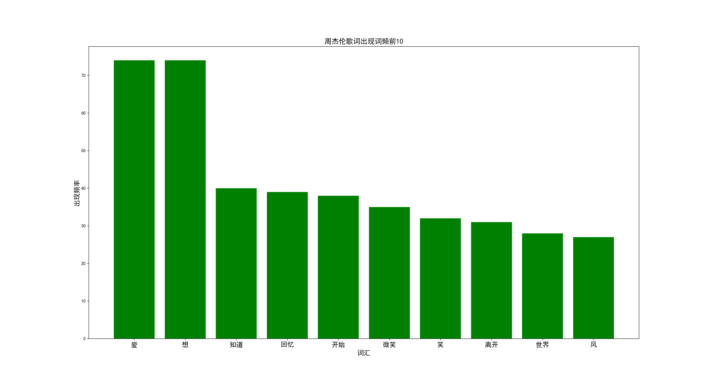

# 酷我音乐周杰伦专辑歌曲歌词分析
## 项目内容
* 抓取酷我音乐周杰伦专辑歌曲，获得周杰伦歌曲歌词。通过对歌词分词、使用词云制作周董歌词词云。
## 项目思路
1. 分析酷我音乐网页页面，依次获取周杰伦专辑名、歌曲、最终获得歌词；
2. 使用 requests 请求数据，由于本次爬取量较小，使用 json 序列化保存获取的数据；
3. 使用 jieba 对周董歌词进行分词；matplotlib 对词频前 10 的词语用柱状图表示，对词频前 300 的词制作词云。
## 运行环境
* python3.7
* windows
* jupyter notebook
## 运行依赖包
* requests
* matplotlib
* jieba
* wordcloud
* json
## 详细流程
1. 酷我专辑接口 <http://www.kuwo.cn/api/www/artist/artistAlbum?artistid=336&pn=1&rn=50> 中使用 requests 获取周杰伦专辑信息；因为周董在酷我处显示专辑数为32，所以请求一次就可以了。并且会返回 json 文件。由于数据量较小这里直接使用 json 序列化文件保存起来。

            # 请求酷我专辑信息接口 
            url = 'http://www.kuwo.cn/api/www/artist/artistAlbum?artistid=336&pn=1&rn=50' # 因为酷我周总专辑列表 32 个，所以一次请求就可以获取完毕
            r = requests.get(url, headers=headers)
            r.json() # requests 内置的 json 解码器
            # 使用 json 序列化
            with open(r'C:\Users\yc\Desktop\zhoujl\albumlist.json', 'w', encoding='utf8') as f:
                json.dump(r.json(),f)
                
2. 通过获取的专辑 id（这里要注意是有的专辑为演唱会的专辑歌曲，会与其他非演唱会的专辑重复，所以我们需要去除演唱会专辑的影响）。获取歌曲 id，接口为'http://www.kuwo.cn/album_detail/' + str(albumid)；最终获取歌曲歌词，接口 'http://m.kuwo.cn/newh5/singles/songinfoandlrc?musicId=' + str(song) 。最后同样使用 json 序列化保存。

            # 第二步 歌曲信息，储存歌词(去除演唱会周总唱歌的重复曲目, 剩189首歌曲)
            from bs4 import BeautifulSoup
            import requests
            import json
            import re
            lyric = []
            headers = {
                'User-Agent':'chrome',
            }
            with open(r'C:\Users\yc\Desktop\zhoujl\albumlist.json', 'r', encoding='utf8') as f:
                albums = json.load(f)
            for album in albums['data']['albumList']: # 专辑列表
                albumid = album['albumid']
                if albumid in {552654, 60643, 16943, 12478, 1291, 1288}: # 去除演唱会专辑
                    continue
                url2 = 'http://www.kuwo.cn/album_detail/' + str(albumid) # 歌曲接口
                r2 = requests.get(url2, headers=headers)
                soup = BeautifulSoup(r2.text)
                res = soup.script.string
                songlist = re.findall(r'rid:(\d+),isListenFee', res) # 歌曲 id 列表
                for song in songlist:
                    url3 = 'http://m.kuwo.cn/newh5/singles/songinfoandlrc?musicId=' + str(song) # 歌词接口
                    r3 = requests.get(url3, headers=headers)  # 歌词在这里
                    lyric.append(r3.json())
            print(len(lyric))
            with open(r'C:\Users\yc\Desktop\zhoujl\lyriclist.json', 'w', encoding='utf8') as f: # 使用 json 序列化列表，保存歌词信息。
                json.dump(lyric,f)
 
3. 使用结巴分词，分词原则为以每一首歌为单位进行分词，并且同一首歌曲里出现的歌词都统一记为 1，即同一首歌中出现多次的词，只能算作一次.

            # 第三步 更换计数方法,已每首歌为单位词汇出现一次，计为1 .同时对可能还存在重的live歌曲清除。(其中没有歌词的歌曲：专辑 黄俊郎的黑 为钢琴曲)
            import jieba
            # 第二步保存的歌曲文件
            with open(r'C:\Users\yc\Desktop\zhoujl\lyriclist.json', 'r', encoding='utf8') as f:
                lyric = json.load(f)
            c = 0
            az = {} # 最终的分词字典
            print(len(lyric))
            title= {'魔术先生（Live）', '英雄-(游戏《英雄联盟》主题曲)'} # 去重集合
            for i,ly in enumerate(lyric): # 歌曲列表
                a = ''
                az2 = {} # 帮助计数的字典
                cc = False
                if ly['data']['lrclist']==None: # 歌曲没有内容
                    c+=1
                    continue
                for i2,line in enumerate(ly['data']['lrclist']): # 歌词列表
                    if i2==0: # 去重，第一行为歌曲名
                        t = re.findall(r'(\S+)\(Live\)|(\S+)-', line['lineLyric'].replace(' ','')) # 获取歌曲名
                        if t==[]:
                            t = ly['data']['songinfo']['songName'] # 对于第一行不是歌名的曲子,从属性中提取
                        for tt in t[0]:
                            if tt !='' and tt not in title: # 歌曲名去重
                                title.add(tt) # 歌曲名
                                cc = True
                    if cc:
                        a+=(line['lineLyric'] + '。') # 拼截歌词
                    else:
                        break
                # 以每一首歌为单位进行分词
                seg_list = jieba.cut(a, cut_all=False)
                for s in seg_list:  # 精确模式
                    az2[s] = az2.get(s,0)+ 1
                for s in az2:
                    if s in {'。', ' ', '的', '我', '-', '周杰伦', '：', '在', '你', '词', '曲', '(', ')', '了', '是', '不', 'Jay', 'Chou', '着', '都', '说', '就', '有', '方文山', '那', '让','却', '很', '这', '编曲', '再', '会', '也', '谁', '要', '对', '还', '没有', '上', '我们', '人', '像', '走', '去', '被', '给', '里', '只', '跟', '没', '怎么', '来', '到', '等', '什么', '看', '而', '好', '又','将', '为', '可以', '才', '把', '他', '听', '过', '用', '已', '多', '能', '一起', '一直', '不是', '它', '自己',  '一个', '如果', '已经', '不会', '太', '不要', '因为', '还是', '只是','但', '叫', '不到', '中', '和', '当', '后', '真的', '想要', '请', '可', '不能', '我会','啊', '比', '林迈', '与', '找', '一点', '吧', '该','下','更', '别', '得', '我用','这样', '写', '一', '就是', '个', '《', '》','地','黄俊郎','（', '）','/','呢', '成','应该', '不过', '有些','是不是','不了','一种','有点', '她', '我要', '一样', '跟着','不用', '只有', '靠', '这么','还有', '拿', '为了','制作','一定', '从','连','做','钟兴民','站', '一遍','只能','一句', '这里','掉', '比较', '那么','向', '无法','这个','啦', '如','吗', '有人', '也许','哪里','起来',}: # jieba 分词，这些为无用词
                        continue
                    az[s] = az.get(s, 0) + 1
            print('共:', i+1, 'None:', c, '分词数：',len(az))
            
4. 选取分词结果前 300 绘制词云，并使用背景图片绘制相应形状的词云。

            # 选取高频的前300词
            fc = sorted(az.items(), key=lambda item:item[1], reverse=True)
            a = [(i[0],i[1]) for i in fc[:300]]
            
            # 绘制词云
            from wordcloud import WordCloud
            import matplotlib.pyplot as plt
            import numpy as np
            from PIL import Image
            
            # 将数据转换为词云所需的字典
            b = {} 
            for i,j in a:
                b[i] = j
            # wordcloud 部分设置
            font_path = r'C:\Users\yc\Desktop\SIMFANG.ttf' # 字体 # wordcloud设置，注意没有这个字体请下载一个哟，不然没办法显示中文
            back_coloring = np.array(Image.open(r'C:\Users\yc\Desktop\zhoujl\z.png').convert('L'))  # 设置背景图片
            # 设置词云属性
            wc = WordCloud(font_path=font_path,  # 设置字体
                           background_color="white",  # 背景颜色
                           max_words=2000,  # 词云显示的最大词数
                           mask=back_coloring,  # 设置背景图片
                           contour_color='green'
                           )
            # 根据频率生成词云
            wc.generate_from_frequencies(b)
            wc.to_file(r'C:\Users\yc\Desktop\zhoujl\zouwc.png') # 保存文件
            # 显示图片
            plt.figure()
            plt.imshow(wc)
            plt.axis("off")
            plt.show()
            
5. 然后取分词的前10个高频词做一张柱状图：

            # 高频词汇分布
            import numpy as np
            import matplotlib.pyplot as plt
            import matplotlib
            import pickle

            #显示图形
            %matplotlib inline 
            # 设置matplotlib正常显示中文和负号
            matplotlib.rcParams['font.sans-serif']=['SimHei']   # 用黑体显示中文
            matplotlib.rcParams['axes.unicode_minus']=False     # 正常显示负号
            matplotlib.rcParams['figure.figsize'] = (22.0, 12.0) # 设置figure_size尺寸

            x,y = [],[]
            a = [('爱', 74), ('想', 74), ('知道', 40), ('回忆', 39), ('开始', 38), ('微笑', 35), ('笑', 32), ('离开', 31), ('世界', 28), ('风', 27)]
            for a1 in a:
                x.append(a1[0])
                y.append(a1[1])

            rects = plt.bar(range(len(y)), y, width=0.8, fc='g') # 条形图

            plt.xticks(range(len(x)), x, fontsize=15)
            plt.xlabel("词汇",fontsize=15)
            plt.ylabel("出现频率", fontsize=15)
            plt.title("周杰伦歌词出现词频前10",fontsize=16)

            plt.savefig(r'C:\Users\yc\Desktop\zhoujl\rank.png', dpi=300) #指定分辨率保存
            plt.show()
6. 最后，需要注意的是，第四步时，是需要一个中文字体的，如 SIMFANG.ttf，没有的要下载一个。不然无法显示中文。其中酷我音乐中共32张周杰伦专辑，去除6张演唱会专辑（周杰伦魔天伦世界巡回演唱会、The Era 2010 超时代演唱会、2007世界巡回演唱会、周杰伦 2004 无与伦比 演唱会 Live CD、The One演唱会、Fantasy Show香港演唱会），最后抓取 **26** 张专辑。共 **189** 首歌曲，**七首**没有歌词，分别为：天才之翼、美丽的消失、过场、热闹的宁静、菊花台(周杰伦钢琴演奏)、轨迹(伴奏)、断了的弦(伴奏)。

## 文件说明
### 数据抓取文件：albumlist.json、lyriclist.json、zjl.text
* albumlist.json 从酷狗音乐获取的周杰伦专辑信息；
* lyriclist.json 对专辑内歌曲分类后，获得的各歌曲歌词列表；
* zjl.text 将所有歌词汇总写入文本文件中。
### 代码文件
* zhoujl.ipynb 和 zhoujl.py zhoujl.py 是从 zhoujl.ipynb 中转的。所以这两个文件内容是一样的。
### 图片文件
* z.png 使用词云绘图传入的模板图；
* wordcloud.png 使用词云绘制的图片；
* rank.py 前10高频词柱状图。
## 图片效果展示
* 高频词柱状图
 
* 高频词词云
 
